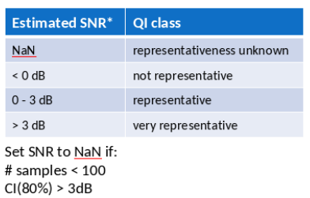

FRM ISMN Qualification from TCA
===============================

.. _ismn_frm:

This module contains the routine to assign FRM qualifications ISMN sensors.
The Quality Indicators (QIs) are based on a Triple Collocation run with
80% CI between ISMN (0-10 cm, "good" time stamps), ERA5-Land ("swvl1") and
ESA CCI SM v06.1 PASSIVE. It uses a triple collocation
validation for all ISMN sensors in 0-10 cm depth from all available networks with
ERA5-Land and ESA CCI SM v06.1 PASSIVE.

To perform the validation use QA4SM or the lower level ``smecv_validation`` package:
https://git.eodc.eu/cci-sm-work/smecv_validation

The following thresholds were used for QA4SM Release 2 (`ISMN_v202301`)

Then a script like the following one can be used to perform the classification
based on the `SNR`, `CI`, and `nobs` metrics for a sensor::

    import os
    from qa4sm_preprocessing.ismn_frm.collect import create_frm_csv_for_ismn

    ismn_data_path = "/home/wpreimes/shares/climers/Projects/FRM4SM/07_data/ismn_data/ISMN_v202301/"
    tcol_val_result = os.path.join(
        ismn_data_path, "preprocessing", "tcol_80p_ci_tcol_ismnGv20230110_ccip_era5", "netcdf",
        "ismn_val_1980-01-01_TO_2022-12-31_in_0_TO_0_1.nc"
    )

    create_frm_csv_for_ismn(
            tcol_val_result,
            var_snr='snr_00-ISMN_between_00-ISMN_and_01-ERA5_LAND_and_02-ESA_CCI_SM_passive',
            var_ci_upper='snr_ci_upper_00-ISMN_between_00-ISMN_and_01-ERA5_LAND_and_02-ESA_CCI_SM_passive',
            var_ci_lower='snr_ci_lower_00-ISMN_between_00-ISMN_and_01-ERA5_LAND_and_02-ESA_CCI_SM_passive',
            var_depth_from='instrument_depthfrom_between_00-ISMN_and_01-ERA5_LAND',
            var_depth_to='instrument_depthto_between_00-ISMN_and_01-ERA5_LAND',
            var_nobs='n_obs',
            plot=False,
            out_path=os.path.join(ismn_data_path, "preprocessing"),
    )

Which will create a .csv file that contains the FRM qualification and SNR value
for all ismn sensors where the validation could be performed. This file can then
be used by the ismn reader package to add the qualification as additional
``python_metadata`` to the data via (this can take some time)::

    import os
    import ismn
    if ismn.__version__ < "1.3.0":
        raise NotImplementedError(
            "Custom metadata readers are only available from "
            "version 1.3.0 of ismn package onwards.")
    from ismn.interface import ISMN_Interface
    from ismn.custom import CustomSensorMetadataCsv
    import numpy as np

    qi_reader = CustomSensorMetadataCsv(
        os.path.join(ismn_data_path, "preprocessing", "frm_classification.csv"),
        fill_values={'frm_class': 'undeducible', 'frm_snr': np.nan, 'frm_nobs': np.nan}
    )

    if os.path.exists(os.path.join(
            ismn_data_path, 'extracted', 'python_metadata')):
        raise ValueError("Metadata already exists, please delete it.")

    ds = ISMN_Interface(os.path.join(ismn_data_path, 'extracted'),
                        custom_meta_reader=[qi_reader], parallel=True)

If at one point the ``python_metadata`` is deleted for some reason, the FRM
qualification must be included again as described above. Otherwise it won't be
found in the ISMN metadata.
